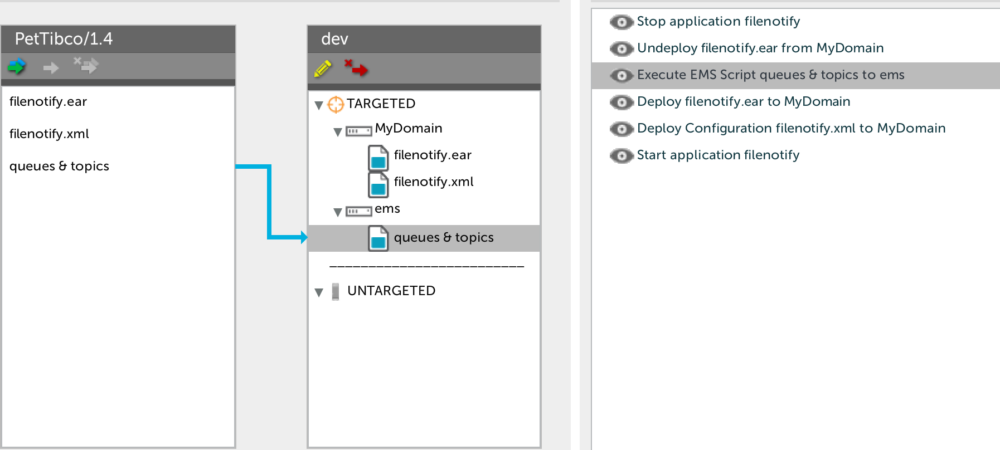

# Preface #

This document describes the functionality provided by the [Tibco Business Work](http://www.tibco.com/products/automation/application-integration/activematrix-businessworks) plugin.

See the [**XL Deploy Reference Manual**](http://docs.xebialabs.com/releases/latest/xl-deploy/starthere.html) for background information on XL Deploy and deployment concepts.

# Overview #

The Tibco Business Work plugin is a XL Deploy plugin that adds capability for deploying  :

* a Tibco Ear to a Tibco domain and its XML configuration
* a queue, a topic and an EMS Script on a EMS Server

# Requirements #

* **XL Deploy requirements**
	* **XLD**: version 4.5.1+

## Types ##

+ tibco.Ear.
+ tibco.Configuration.
+ tibco.Queue
+ tibco.Topic
+ tibco.EmsScript.

# Sample computed task #

This is below a typical computed task by the Tibco Business Work plugin during an upgrade.

