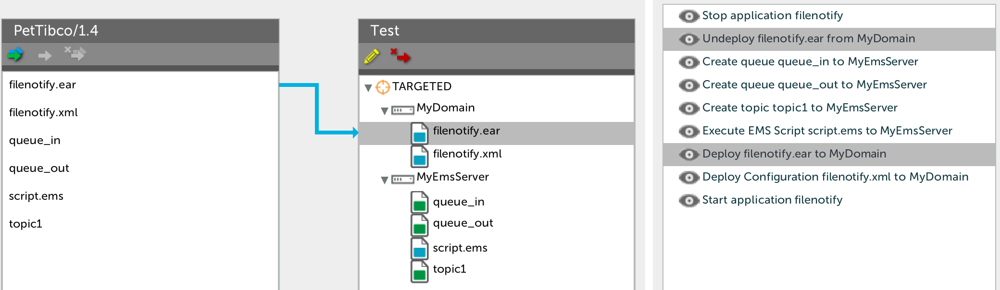

# Preface #

This document describes the functionality provided by the [Tibco Business Works](http://www.tibco.com/products/automation/application-integration/activematrix-businessworks) plugin.

See the [**XL Deploy product description**](https://docs.xebialabs.com/xl-deploy/) for background information on XL Deploy and deployment concepts.

# Overview #

The Tibco Business Work plugin is a XL Deploy plugin that adds capability for deploying  :

* a Tibco Ear to a Tibco domain and its XML configuration
* a queue, a topic and an EMS Script on a EMS Server

Warning: Tibco BW domains running on Windows Machines are not well supported (so far)

# What's new in version 1.2.0 #

* Fix bugs regarding libs deploy
* Add parameters for adapter JVM configuration (JVM tab)
* Add parameters for extended properties configuration (Extended properties tab)
* Fault tolerant and clustering deploy options moved to Fault taulernt tab


# What's new in version 1.1.0 #

* Prepend libraries deploy
* TIBCO BW ActiveAspects Plug-in libraries deploy
* Fault tolerant and clustering deploy
* Use dictionary to set Global Variables and Adapter SDK Properties within a Tibco artifact file

# Upgrade from version 1.0.0 #

tibco.Domain type has been splitted to new version of tibco.Domain and tibco.Node type. You should create and configure tibco.Node object within container with tibco.Domain object.

# Extended properties

Extended properties tab allows to set java.extended.properties, Jmx.Enabled and other properties inside TRA-file.

`Tra Map` parameter can be used to set any other properties. For example you need to enable jmxremote by adding following strings into TRA file

```
Jmx.Enabled=true
java.property.com.sun.management.jmxremote=true
java.property.com.sun.management.jmxremote.authenticate=false
java.property.com.sun.management.jmxremote.ssl=false
java.property.java.rmi.server.useLocalHostname=true
java.property.com.sun.management.jmxremote.port=55555
```

You should check `Jmx Enable` checkbox and add `java.property..` strings to Tra Map. Tra Map parameters also can be filled from dictionary. Key `tibco.DeployedEar.TraMap` should have value  `java.property.com.sun.management.jmxremote:true, java.property.com.sun.management.jmxremote.authenticate:false, java.property.com.sun.management.jmxremote.ssl:false, java.property.java.rmi.server.useLocalHostname:true, java.property.com.sun.management.jmxremote.port:55555`

in one string.

# Howto use dictionary to set variables within a Tibco artifact file

The tibco.Ear artifact should be created with configurationMap and configurationMapAdapterSDK properties


For example I'm using [Jenkins XLD plugin](https://wiki.jenkins-ci.org/display/JENKINS/XL+Deploy+Plugin)

1. First step is a bash script
```
bash
jar xvf ${ADAPTER}-${VERSION}*.ear
PLACEHOLDERS=$(xmlstarlet sel -N _=http://www.tibco.com/xmlns/dd \
    -t -v '/_:DeploymentDescriptors/_:NameValuePairs/_:*[_:requiresConfiguration="true"]/_:name' TIBCO.xml | xargs)
jar xvf Process\ Archive.par
SDK_PLACEHOLDERS=$(xmlstarlet sel -N _=http://www.tibco.com/xmlns/dd \
    -t -v '/_:DeploymentDescriptors/_:*[_:name="Adapter SDK Properties"]/_:NameValuePair/_:name' TIBCO.xml | xargs)
for e in $PLACEHOLDERS
do
    s="$e={{$e}}"
    if [ "x${PMAP}" = "x" ]
    then
        PMAP=$s
    else
        PMAP="${PMAP}&${s}"
    fi
done

for e in $SDK_PLACEHOLDERS
do
    s="$e={{$ADAPTER/$e}}"
    if [ "x${SDK_PMAP}" = "x" ]
    then
        SDK_PMAP=$s
    else
        SDK_PMAP="${SDK_PMAP}&${s}"
    fi
done


echo PMAP=${PMAP} > env.txt
echo SDK_PMAP=${SDK_PMAP} >> env.txt
```

2. Then inject env.txt with [EnvInject Plugin](https://wiki.jenkins-ci.org/display/JENKINS/EnvInject+Plugin)
3. Package application with XLD Jenkins plugin and assign '${PMAP}' to 'configurationMap' and '${SDK_PMAP}' to 'configurationMapAdapterSDK' properties


Preffixes can be used for configuration maps values. For example line `s="$e={{$ADAPTER/$e}}"` in my script just add adapter name as preffix to configurationMapAdapterSDK values.
And I can set different values to `bw.platform.services.retreiveresources.Httpport` properties for different adapters by `adapter1/bw.platform.services.retreiveresources.Httpport` and `adapter2/bw.platform.services.retreiveresources.Httpport` dictionary entries.


# Requirements #

* **XL Deploy requirements**
	* **XLD**: version 4.5.1+
* The containers with tibco.Domain and tibco.Node objects should have xmllint and xmlstarlet tools

## Types ##

+ tibco.Ear
+ tibco.Domain
+ tibco.Node
+ tibco.Configuration
+ tibco.Queue
+ tibco.Topic
+ tibco.EmsScript
+ tibco.PrependLib
+ tibco.BwaaLib
+ tibco.BwaaAspect


# Sample computed task #

This is below a typical computed task by the Tibco Business Work plugin during an upgrade.


